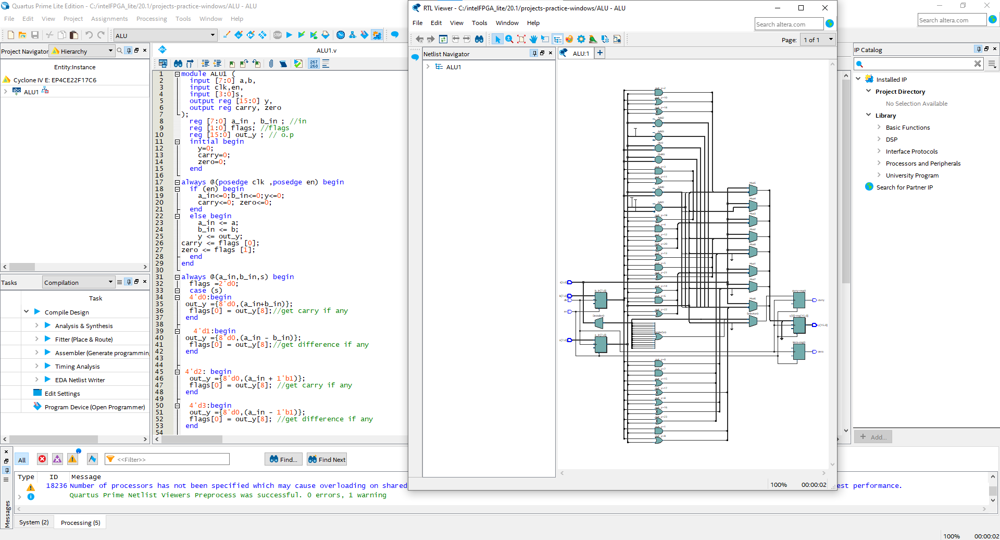

# Arithmetic Logic Unit (ALU)

## Introduction

-The **Arithmetic Logic Unit (ALU)** is a fundamental component of a computer's central processing unit (CPU). It performs arithmetic and logical operations on binary data. This repository contains the Verilog implementation of an ALU, which is a critical part of any processor or microcontroller.

-In this project i have tried my best to learn the operation of ALU and replicate it through verilog coding.
## ALU Features

- Supports a wide range of arithmetic operations, including addition, subtraction, multiplication, and division,increment,decrement.
- Performs logical operations such as AND, OR, XOR, and NOT.
- Handles both signed and unsigned integer arithmetic.
- Customizable word length to fit the requirements of your CPU design.
- Designed for easy integration into larger CPU projects.

## ALU RTL View

- "RTL view gives the implementation of the code," we mean that the RTL description provides a detailed specification of how the functionality of the digital circuit, in this case, the ALU, is realized.
  

## ALU Operation Truth table:
 -this is based of an 8 bit ALU (based of the designed ALU's output)
 

  

## ALU results for the following code simulated using modelsim Altera:

